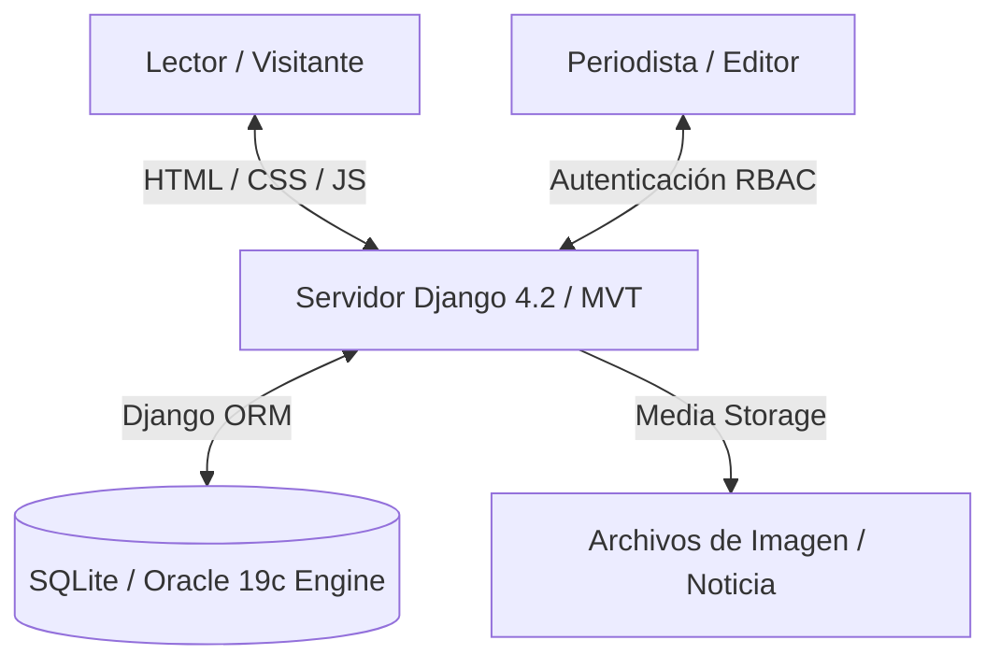

# Portal de Noticias y Periodismo Colaborativo — CaosNews

**CaosNews** es un portal web de noticias y periodismo colaborativo desarrollado en **Django 4.2** bajo arquitectura MVT (Model-View-Template). La plataforma implementa un flujo editorial completo de moderación con control de acceso basado en roles (RBAC) donde redactores externos pueden someter artículos que requieren aprobación de editores antes de ser publicados en la portada pública.

---

## 🎯 Propósito del Proyecto

Diseñar un portal informativo robusto y escalable que permita:
1. Una portada pública de noticias categorizada (Política, Economía, Deportes, Salud, Reportaje, Internacional) con buscador y maquetación adaptativa.
2. Un flujo de moderación editorial jerárquico (Periodista ➔ Redacción ➔ Pendiente de Aprobación ➔ Editor ➔ Publicado).
3. Un panel de administración y perfil privado para gestión de publicaciones de cada periodista.
4. Soporte multi-motor de base de datos (SQLite en entorno de desarrollo/docker y Oracle 19c en entornos enterprise).

---

## 🏗️ Arquitectura del Sistema

El sistema utiliza la arquitectura clásica monolítica MVT de Django con aislamiento mediante contenedores Docker:



### Componentes de la Arquitectura
* **Capa de Vistas y Plantillas (MVT):** Plantillas HTML5 organizadas con herencia Jinja (`base1.html`, `base2.html`), maquetación con Bootstrap 5 y hojas de estilo CSS personalizadas.
* **Capa de Control de Acceso (RBAC & Moderación):** Sistema de permisos granulares integrado con `django.contrib.auth` que restringe las acciones de publicación únicamente a usuarios con rol Editor/Admin.
* **Capa de Persistencia (Django ORM):** Mapeo objeto-relacional para gestión de noticias, categorías, estados de publicación y usuarios.

---

## 🚀 Stack Tecnológico

* **Core Backend:** [Django v4.2](https://www.djangoproject.com/), [Python 3.11](https://www.python.org/).
* **Base de Datos:** [SQLite3](https://www.sqlite.org/) (Docker local) / [Oracle 19c](https://www.oracle.com/database/).
* **Frontend UI:** [HTML5](https://developer.mozilla.org/es/docs/Web/HTML), [CSS3](https://developer.mozilla.org/es/docs/Web/CSS), [Bootstrap 5](https://getbootstrap.com/), [JavaScript (Vanilla)](https://developer.mozilla.org/es/docs/Web/JavaScript).
* **Contenedores:** [Docker](https://www.docker.com/) (`python:3.11-slim` en puerto `8001`).

---

## 📁 Estructura del Proyecto

```text
/caosnews
├── CaosNews/                    # Configuración principal de Django (settings.py, urls.py, wsgi.py)
├── webcaosnews/                 # Aplicación periodística principal
│   ├── migrations/              # Migraciones de base de datos
│   ├── models.py                # Modelos (Noticia, Categoria, Estado, PerfilUsuario)
│   ├── templates/               # Plantillas HTML5 (index.html, noticia.html, ingreso.html, etc.)
│   ├── static/                  # Archivos estáticos (CSS, JS, imágenes de diseño)
│   ├── urls.py                  # Enrutamiento de URLs periodísticas
│   └── views.py                 # Lógica de controladores de noticias y moderación
├── media/                       # Almacenamiento local de fotografías de noticias
├── db.sqlite3                   # Base de datos pre-poblada con noticias y noticias de muestra
└── Dockerfile                   # Imagen Docker del Portal (Puerto 8001)
```

---

## 📈 Fases del Proyecto

### Fase 1: Maquetación y Backend Inicial (100% Completada) ✅
* [x] Estructuración de plantillas HTML5 base y navegación por categorías.
* [x] Creación de modelos de datos relacionales en Django ORM.
* [x] Implementación de sistema de autenticación de periodistas y editores.

### Fase 2: Flujo Editorial y Contenedorización (100% Completada) ✅
* [x] Desarrollo del panel de moderación y aprobación de borradores.
* [x] Configuración de Dockerfile ligero y habilitación de iFrame (`X_FRAME_OPTIONS = 'ALLOWALL'`).

---

## 🛠️ Ejecución Local con Docker

### 1. Clonar el repositorio y levantar el contenedor:
```bash
docker compose up -d --build caosnews
```

### 2. Acceder al portal local:
* **Portal CaosNews:** [`http://localhost:8001/`](http://localhost:8001/) (Login Editor: `admin` / `admin123`)
