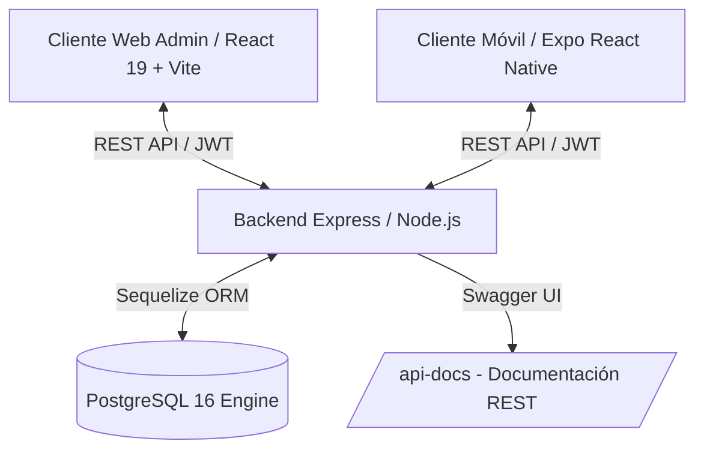

# Sistema Omnicanal de Inventarios y Órdenes de Compra — InventPro

**InventPro** es una solución integral desacoplada diseñada para la gestión de inventario, proveedores y órdenes de compra en tiempo real para empresas y PyMEs. El sistema combina una arquitectura Backend en **Node.js/Express** con **PostgreSQL**, una **Aplicación Web SPA en React 19 + Vite** para gerencia, y una **Aplicación Móvil en Expo (React Native)** para operarios de bodega.

> **Créditos del Equipo de Desarrollo (Duoc UC):**  
> * **Franco Borotto Vidal** — Desarrollador Frontend Lead (React Web & Integración Móvil Expo)  
> * **Javier Hermosilla** — Desarrollador Backend Lead (Node.js REST API & PostgreSQL)  
> * **Claudio Soto** — Co-Desarrollador & Integración de Módulos  

---

## 🎯 Propósito del Proyecto

Resolver el descalce continuo entre el inventario contable de oficina y el stock físico real en bodega mediante:
1. Una consola Web SPA en tiempo real para gerencia, supervisión de órdenes de compra y control de catálogo.
2. Una aplicación móvil nativa/web para operarios de bodega que permite registrar movimientos manuales de inventario y recepciones de mercadería.
3. Un motor centralizado de reglas de negocio con alertas de stock crítico y estados de orden automatizados (Pendiente ➔ Aprobada ➔ Recibida).
4. Seguridad estricta basada en roles (RBAC) con tokens JWT y cifrado de contraseñas con bcrypt.

---

## 🏗️ Arquitectura del Sistema

El proyecto opera bajo una arquitectura de microservicios/APIs RESTful desacopladas en contenedores Docker:



### Componentes de la Arquitectura
* **Backend REST API (Node.js & Express):** Servidor HTTP modular con rutas autenticadas vía JWT, controladores validados con Zod, middleware de sanitización (XSS, HPP, Helmet) y logging con Winston/Morgan.
* **Cliente Web Administrador (React 19, Vite, TailwindCSS & Zustand):** Single Page Application para gerencia con gráficos de inventario, alertas de stock mínimo, gestión de clientes/proveedores y emisión de órdenes.
* **Cliente Móvil Operario (Expo / React Native Web & Zustand):** App para smartphones y terminales de bodega enfocada en operaciones rápidas de ingreso/salida de productos y confirmación de recepción.
* **Persistencia Relacional (PostgreSQL & Sequelize ORM):** Esquema relacional `inventpro_user` con migraciones automáticas, eliminaciones lógicas (soft delete) y aislamiento por roles.

---

## 🚀 Stack Tecnológico

* **Backend:** [Node.js v20](https://nodejs.org/), [Express v5](https://expressjs.com/), [Sequelize ORM](https://sequelize.org/), [Zod](https://zod.dev/), [JWT](https://jwt.io/), [Swagger](https://swagger.io/).
* **Base de Datos:** [PostgreSQL 16](https://www.postgresql.org/) con soporte de esquemas personalizados.
* **Frontend Web:** [React 19](https://react.dev/), [Vite](https://vitejs.dev/), [Zustand](https://github.com/pmndrs/zustand), [TailwindCSS v4](https://tailwindcss.com/), [SweetAlert2](https://sweetalert2.github.io/).
* **App Móvil:** [Expo v54](https://expo.dev/) (React Native), [Expo Router](https://docs.expo.dev/router/introduction/), [Axios](https://axios-http.com/).
* **Infraestructura:** [Docker & Docker Compose](https://www.docker.com/) para orquestación aislada en 1 comando.

---

## 📁 Estructura del Proyecto

```text
/inventpro
├── BackEnd/                    # Servicio REST API Node.js/Express
│   ├── config/                 # Configuración Sequelize (config.cjs) y Swagger
│   ├── migrations/             # Migraciones de estructura de base de datos
│   ├── models/                 # Modelos Sequelize (User, Product, Order, Supplier, Client)
│   ├── scripts/                # Scripts de semillas y mantenimiento (db-reset)
│   ├── src/
│   │   ├── controllers/        # Lógica de controladores de negocio
│   │   ├── db/                 # Conexión Sequelize y bootstrap de administrador
│   │   ├── middleware/         # Autenticación JWT, RBAC, validación Zod y sanitización
│   │   ├── routes/             # Rutas API (/api/auth, /api/products, /api/orders, etc.)
│   │   ├── app.js              # Inicialización de servidor Express y middlewares
│   │   └── server.js           # Entrypoint HTTP (Puerto 3001)
│   └── Dockerfile              # Imagen Docker del Backend
├── FrontEnd/                   # Cliente Web SPA React
│   ├── src/                    # Componentes, vistas y stores Zustand
│   ├── package.json            # Dependencias React 19 + Vite
│   └── Dockerfile              # Servidor de producción Web (Puerto 8003)
├── MobileManualInventory/     # Cliente Móvil Expo React Native
│   ├── app/                    # Vistas y pantallas Expo Router (Bodeguero)
│   ├── components/             # Componentes móviles reutilizables
│   └── Dockerfile              # Contenedor Expo Web (Puerto 8005)
└── docker-compose.yml          # Orquestador unificado Docker
```

---

## 📈 Fases del Proyecto

### Fase 1: Arquitectura Base, BD y API REST (100% Completada) ✅
* [x] Diseño relacional de base de datos PostgreSQL en modelo `inventpro_user`.
* [x] Desarrollo de endpoints RESTful en Express con validaciones Zod y Swagger OpenAPI.
* [x] Implementación de seguridad JWT, hashing de claves con bcryptjs y roles de usuario.

### Fase 2: Frontends Web & Móvil e Integración (100% Completada) ✅
* [x] Construcción del Dashboard Web en React 19 con vistas de Stock, Proveedores y Órdenes.
* [x] Desarrollo de la App Móvil en Expo para operarios de bodega.
* [x] Orquestación containerizada con Docker Compose para levantamiento en 1 clic.

---

## 🛠️ Ejecución Local con Docker

### 1. Clonar el repositorio y levantar contenedores:
```bash
docker compose up -d --build
```

### 2. Acceder a los servicios locales:
* **Web Administrador:** [`http://localhost:8003/`](http://localhost:8003/) (Login: `admin@inventpro.cl` / `Admin123$`)
* **App Bodeguero Móvil:** [`http://localhost:8005/`](http://localhost:8005/) (Login: `bodeguero@inventpro.cl` / `Admin123$`)
* **Documentación REST API:** [`http://localhost:3001/api-docs/`](http://localhost:3001/api-docs/)
* **Base de Datos PostgreSQL:** `localhost:5433` (DB: `inventpro`, User: `inventpro_user`)
