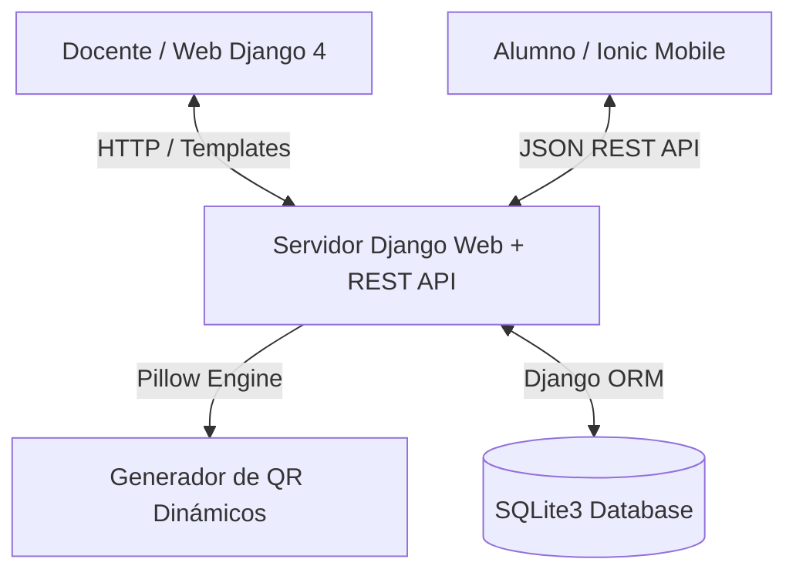

# Sistema de Control Asistencial Académico por QR — Registra APP

**Registra APP** es un ecosistema de gestión asistencial universitaria en tiempo real que automatiza la toma de asistencia en aulas mediante la generación dinámica y escaneo de códigos QR entre la aplicación docente (Web Django) y la aplicación del estudiante (Móvil Ionic/Capacitor).

> **Créditos del Equipo de Desarrollo (Duoc UC):**  
> * **Franco Borotto Vidal** — Desarrollador Lead Web & Móvil  
> * **Luis Valenzuela** — Co-Desarrollador  

---

## 🎯 Propósito del Proyecto

Eliminar el tiempo muerto en aulas universitarias y prevenir la suplantación de identidad en la toma de asistencia mediante:
1. Generación de códigos QR únicos y dinámicos creados por el profesor al iniciar cada bloque de clases.
2. Lectura instantánea del QR por parte del alumno mediante la cámara de su dispositivo móvil.
3. Registro centralizado en tiempo real con cálculo automático del porcentaje de asistencia por asignatura.
4. Consola docente para emisión de comunicados de sección, libro de anotaciones y seguimiento de situación académica de alumnos.

---

## 🏗️ Arquitectura del Sistema

El ecosistema se compone de una arquitectura distribuida donde el servidor Web Django expone tanto la interfaz del profesor como servicios API REST para la app móvil:



### Componentes de la Arquitectura
* **Servidor Web Docente (Django 4.1 & Python 3.11):** Aplicación MVT con vistas para control de cursos, apertura/cierre de clases en vivo, visualización de asistencia, registro de notas y envío de comunicados.
* **App Móvil Estudiante (Ionic 6, Angular & Capacitor):** Aplicación móvil multiplataforma para consulta de horario, malla curricular, notas por periodo y lector de QR para confirmación de asistencia.
* **Motor QR (Pillow & qrcode):** Generación al vuelo de códigos QR vectoriales con parámetros de seguridad vinculados a la clase y sesión activa.

---

## 🚀 Stack Tecnológico

* **Backend & Web:** [Django v4.1](https://www.djangoproject.com/), [Python 3.11](https://www.python.org/), [Django REST Framework](https://www.django-rest-framework.org/).
* **Motor de QR & Imágenes:** [Pillow](https://python-pillow.org/), [qrcode](https://pypi.org/project/qrcode/).
* **Frontend Móvil:** [Ionic Framework v6](https://ionicframework.com/), [Angular](https://angular.io/), [Capacitor](https://capacitorjs.com/).
* **Base de Datos:** [SQLite3](https://www.sqlite.org/).
* **Contenedores:** [Docker](https://www.docker.com/) con soporte de inserción en iFrame (`X_FRAME_OPTIONS = 'ALLOWALL'`).

---

## 📁 Estructura del Proyecto

```text
/registra-app
├── registra_app_web/               # Servidor Django Web & API
│   ├── DjangoRegistroWeb/          # Configuración del proyecto Django (settings.py, urls.py)
│   ├── RegistroAppDocente/         # Aplicación docente principal
│   │   ├── migrations/             # Migraciones de base de datos
│   │   ├── models.py               # Modelos (Curso, Alumno, Profesor, Clase, Materia, Notas, Anotacion)
│   │   ├── templates/              # Plantillas HTML5 responsivas
│   │   ├── urls.py                 # Enrutamiento web y endpoints API
│   │   └── views.py                # Lógica de controladores y generación QR
│   ├── db.sqlite3                  # Base de datos pre-poblada con datos de prueba
│   └── Dockerfile                  # Imagen Docker de la Web Docente (Puerto 8002)
└── registra_app_mobile/            # Aplicación Móvil Ionic Alumno
    ├── src/                        # Código fuente Angular/Ionic (páginas, servicios)
    ├── package.json                # Dependencias Ionic & Capacitor
    └── Dockerfile                  # Imagen Docker de la App Móvil (Puerto 8100)
```

---

## 📈 Fases del Proyecto

### Fase 1: Desarrollo Core, QR Engine y API (100% Completada) ✅
* [x] Modelado de base de datos académica (Cursos, Secciones, Alumnos, Profesores, Clases).
* [x] Desarrollo del motor backend de generación de códigos QR en tiempo real.
* [x] Consola Web Docente con gestión de clases y asistencia.

### Fase 2: App Móvil y Pruebas Integradas (100% Completada) ✅
* [x] Desarrollo de la interfaz móvil en Ionic para alumnos.
* [x] Integración de escáner QR y comunicación vía REST API con Django.
* [x] Dockerización de ambos entornos para ejecución en puerto `8002` (Web) y `8100` (Mobile).

---

## 🛠️ Ejecución Local con Docker

### 1. Clonar el repositorio y levantar contenedores:
```bash
docker compose up -d --build registra-web registra-mobile
```

### 2. Acceder a los servicios locales:
* **Web Docente:** [`http://localhost:8002/`](http://localhost:8002/) (Login: `admin` / `admin123` o `luis` / `admin123`)
* **App Móvil Alumno:** [`http://localhost:8100/`](http://localhost:8100/) (Login: `estudiante` / `1234`)
